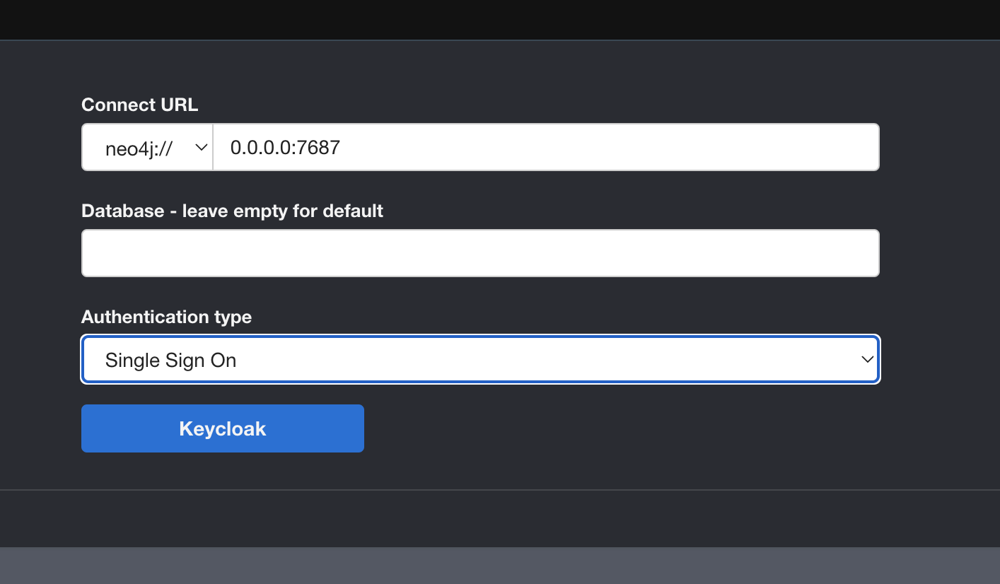

# Neo4j SSO with Keycloak

Uses Neo4j's own SSO capabilities.

## What's inside ?

This repository contains a fuly pre-configured setup with Docker :

### Neo4j

- [Neo4j 5.x](https://neo4j.com) running on http://localhost:7474
- Movies DB created with movies data
- Admins DB created with one Admin node
- Native authentication : `neo4j / password`
- Role `analyst` created with access to movies db, denied on `Person::born` property

### Keycloak

- [Keycloak 25.x](https://www.keycloak.org/) (on Quarkus) running on http://localhost:8180
- Keycloak administrator credentials : `admin / admin123`
- Realm named `my-realm` created
- A `public openid` client named `neo4j-sso` created with 2 client roles `admin` and `analyst`
- Two users configured
    - `admin / password` -> has `admin` role mapped to `neo4j-sso` client
    - `analyst / password` -> has `analyst` role mapped to `neo4j-sso` client


> If you want to use a non-Quarkus setup of Keycloak, check out the `keycloak-15` branch of this repository

---

## SSL Certificates

> **Warning**

Since Neo4j 5.3, URIs for connecting to OIDC providers **must** use `HTTPS` so it requires to create locally self-signed certificates and Keycloak to be configured with https.

This repository contains a `certificates` directory, we will use it to store our self-signed certificates.

To generate the certificates we will use mkcert, but using a Docker image so you don't have to install anything locally.

First, choose a domain name for your local development, the examples will use `keycloak`, make sure to replace the occurrences with your chosen domain name when instructed.

### Generate the certificates

From the root of this repo, run the following command ( replace `keycloak` with your chosen domain name )

```bash
docker run --rm -it -e domain=keycloak --name mkcert -v $PWD/certificates:/root/.local/share/mkcert ikwattro/mkcert-docker


// out
Created a new local CA 💥
The local CA is now installed in the system trust store! ⚡️


Created a new certificate valid for the following names 📜
 - "keycloak"

The certificate is at "./keycloak.pem" and the key at "./keycloak-key.pem" ✅

It will expire on 17 March 2025 🗓
```

This will generate 4 files in the certificates directory

```bash
ls -la certificates

// out
$ ls -la certificates/
total 40
drwxr-xr-x   7 christophewillemsen  staff   224 Dec 17 22:07 ./
drwxr-xr-x  10 christophewillemsen  staff   320 Dec 17 17:50 ../
-rw-r--r--   1 christophewillemsen  staff    13 Dec 17 15:15 .gitignore
-rw-------   1 christophewillemsen  staff  1704 Dec 17 22:07 keycloak-key.pem
-rw-r--r--   1 christophewillemsen  staff  1476 Dec 17 22:07 keycloak.pem
-r--------   1 christophewillemsen  staff  2484 Dec 17 22:07 rootCA-key.pem
-rw-r--r--   1 christophewillemsen  staff  1639 Dec 17 22:07 rootCA.pem
```

You will now need to add the root certificate authority to your OS trustore, the following instruction is for Mac OSX

```bash
sudo security add-trusted-cert -d -r trustRoot -k /Library/Keychains/System.keychain $PWD/certificates/rootCA.pem
```

Now we need to add the certificates to a java cacerts file, the easiest way to do this is to copy the cacerts file from a neo4j container

```bash
docker build -t java-cacerts-import --build-arg CERTIFICATES_PATH=certificates  -f CacertsDockerfile .
```

```bash
docker run --rm -it --name neo4j-cacerts -v $(PWD)/certificates:/tmp/cacerts java-cacerts-import
```

The latest command added the `cacerts` file in the `certificates` directory

```bash
$ ls -la certificates/
total 48
drwxr-xr-x   8 christophewillemsen  staff   256 Dec 17 22:19 ./
drwxr-xr-x  10 christophewillemsen  staff   320 Dec 17 17:50 ../
-rw-r--r--   1 christophewillemsen  staff    13 Dec 17 15:15 .gitignore
-rw-r--r--   1 christophewillemsen  staff  1558 Dec 17 22:19 cacerts
-rw-------   1 christophewillemsen  staff  1704 Dec 17 22:07 keycloak-key.pem
-rw-r--r--   1 christophewillemsen  staff  1476 Dec 17 22:07 keycloak.pem
-r--------   1 christophewillemsen  staff  2484 Dec 17 22:07 rootCA-key.pem
-rw-r--r--   1 christophewillemsen  staff  1639 Dec 17 22:07 rootCA.pem
```

The last step is to add `keycloak` or your chosen domain name to your `/etc/hosts` file

```
127.0.0.1	keycloak
```

## Launch

If you didn't use `keycloak` is to edit the variable `LOCAL_DEV_HOST` in the `.env` file of this repository with your chosen domain name.

The `docker-compose` file is configured for taking into account the usage of local certificates, mainly the following sections are relevant : 

- the `cacerts` file mounted in the neo4j container
- `extra_hosts` section for the `neo4j` and `keycloak-config` services so they use the host's entry for the domain name
- using the certificates in the `keycloak` startup command

```bash
docker compose up -d
```

### Login

Go to the Neo4j browser (http://localhost:7474/), choose SSO for the login and log in with `admin/password` credentials




Check you can access the `movies` and `admins` db.

Go to Keycloak and clear all sessions.

Go back to the Neo4j browser, login again but this time with `analyst / password` credentials

You should see only the `movies` and `neo4j` databases, you also shouldn't see the `born` property on the `Person` nodes.
