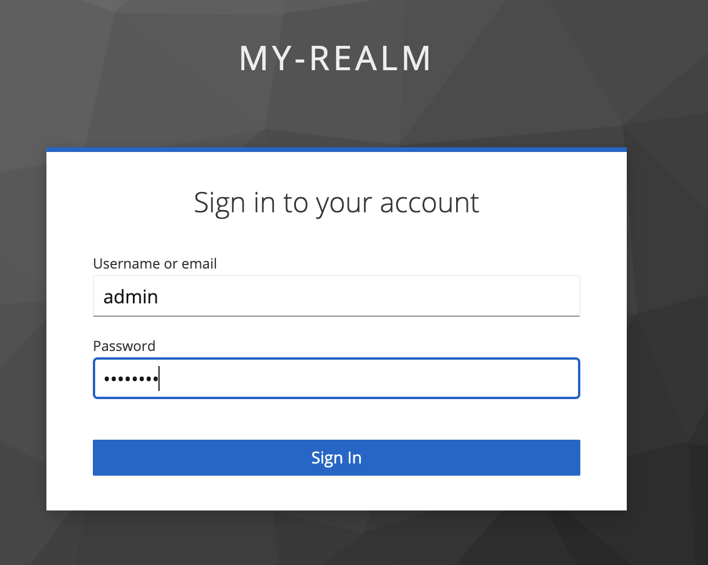

# Neo4j SSO with Keycloak

Uses Neo4j's own SSO capabilities.

## What's inside ?

This repository contains a fuly pre-configured setup with Docker :

### Neo4j

- [Neo4j 4.4](https://neo4j.com) running on http://localhost:7474
- Movies DB created with movies data
- Admins DB created with one Admin node
- Native authentication : `neo4j / password`
- Role `analyst` created with access to movies db, denied on `Person::born` property

### Keycloak

- [Keycloak 19.0.1](https://www.keycloak.org/) (on Quarkus) running on http://localhost:8180
- Keycloak administrator credentials : `admin / admin123`
- Realm named `my-realm` created
- A `public openid` client named `neo4j-sso` created with 2 client roles `admin` and `analyst`
- Two users configured
    - `admin / password` -> has `admin` role mapped to `neo4j-sso` client
    - `analyst / password` -> has `analyst` role mapped to `neo4j-sso` client


> If you want to use a non-Quarkus setup of Keycloak, check out the `keycloak-15` branch of this repository

## Launch

```bash
docker-compose up -d
```

### Login

Go to the Neo4j browser, choose SSO for the login and log in with `admin/password` credentials




Check you can access the `movies` and `admins` db.

Go to Keycloak and clear all sessions.

Go back to the Neo4j browser, login again but this time with `analyst / password` credentials

You should see only the `movies` and `neo4j` databases, you also shouldn't see the `born` property on the `Person` nodes.